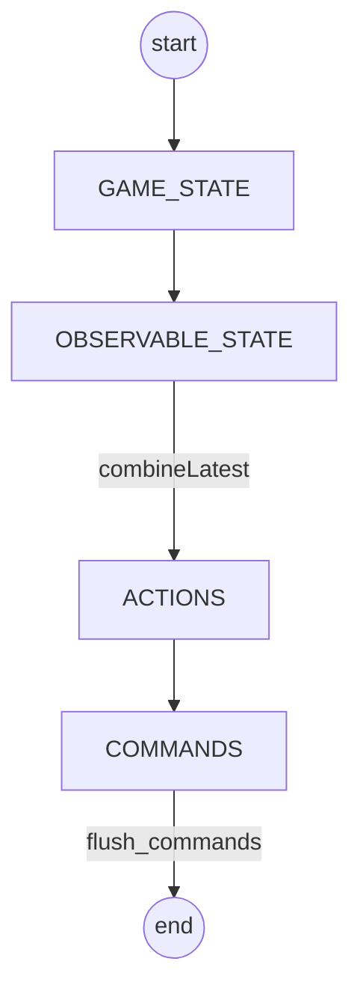

# screeps-fu

A poorly performing screeps bot.

## Design

## Contributing

[.github/contributing.md](./.github/contributing.md)

## Dev-Fu

- https://esbuild.github.io/api/#target
- forget build/push, just do a watcher and sync to `/mnt/c/Users/cdaringe/AppData/Local/Screeps/scripts/screeps.com`
